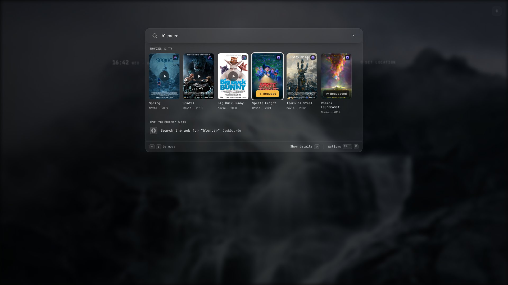

# Holm

**One home page for everyone in the house.** You set it up once; each person signs in and gets their own start page: their apps, their bookmarks, their wallpaper.


Most self-hosted dashboards are built by one admin, for one admin. Holm is for the *rest* of your household, team or friends: the people who use your server but will never edit a YAML file. They sign in through your existing SSO, get walked through the apps you run, and arrange their own surface without touching anyone else's.

## Why Holm

- **Multi-user from the start.** Every person has their own layout, theme and bookmarks, stored server-side and synced across devices. You curate the catalog; they pick from it.
- **Uses the login you already have.** OIDC with Authelia, Authentik, Keycloak, Zitadel or any provider. Give an app `groups:` and only those groups see it.
- **A launcher, not just a grid.** Type anywhere (or `⌘K` / `Ctrl+K`) to find apps, run commands, and search inside Immich, Paperless, Nextcloud, Jellyfin, Plex, Navidrome, Audiobookshelf, Mealie, Seerr, Planka and Karakeep, each with the user's own login.
- **Onboarding for non-technical people.** Welcome slides and per-app setup guides with App Store / Play links.
- **One YAML file.** No admin UI to keep in sync. Apps, branding and most settings reload on save; OIDC, database and key settings need a restart.
- **Small and private.** A single container (amd64 / arm64) with built-in SQLite, so there's no separate database to run. No telemetry. A few features reach public services; [what leaves the box](#what-leaves-the-box) lists them.

<p>
  
  
</p>

Search reaches inside the apps people have connected, with their own login: one query for "spring" finds a film in Jellyfin, documents in Paperless and photos in Immich.


<sub>Mock data. Search-result photos in these screenshots are CC0 from Wikimedia Commons; the <i>Spring</i> poster is by Blender Studio, <a href="https://creativecommons.org/licenses/by/4.0/">CC BY 4.0</a>.</sub>

With Seerr connected, films and shows that aren't on the media server yet can be requested right from the results, as that person. Titles already there play in Jellyfin or Plex.


<sub>Mock data. Posters are Blender open movies from Wikimedia Commons: <i>Spring</i>, <i>Sprite Fright</i> and <i>Cosmos Laundromat</i> <a href="https://creativecommons.org/licenses/by/4.0/">CC BY 4.0</a>; <i>Sintel</i>, <i>Big Buck Bunny</i> and <i>Tears of Steel</i> <a href="https://creativecommons.org/licenses/by/3.0/">CC BY 3.0</a>, © Blender Foundation / Blender Studio.</sub>

Each app can carry a short setup guide: what to install, the steps, and the server URL to copy.


Pick a light or dark theme, or let the wallpaper set the mood:


## Try it in one command

No identity provider needed; this runs the bundled demo with login turned off:

```bash
docker run --rm -p 3000:3000 -e CONFIG_PATH=/app/config.demo.yml ghcr.io/man15h/holm:latest
```

Open http://localhost:3000. Everyone who reaches the port is the same "Guest", so keep it on your own machine.

## Install

```yaml
# docker-compose.yml
services:
  holm:
    image: ghcr.io/man15h/holm:latest
    ports:
      - "3000:3000"
    environment:
      - OIDC_CLIENT_ID=your-client-id
      - OIDC_CLIENT_SECRET=your-client-secret
      - HOLM_SECRET_KEY=${HOLM_SECRET_KEY} # in .env: openssl rand -hex 32
    volumes:
      - ./config.yml:/app/config.yml:ro
      - holm-data:/app/data
    restart: unless-stopped

volumes:
  holm-data:
```

1. Copy [`config.example.yml`](config.example.yml) to `config.yml`.
2. Register Holm as an OIDC client with your provider. The redirect URI is `https://<your-holm-host>/auth/callback`. The example config reads `${OIDC_CLIENT_ID}` and `${OIDC_CLIENT_SECRET}`, so Holm won't start until both are set (or you set `auth.enabled: false`).
3. Set `auth.oidc.issuer` and `redirect_base`, list your apps, and run `docker compose up -d`.

Holm refuses to start, and logs why, when the config is missing or invalid, when it names an unset `${VAR}`, when `HOLM_SECRET_KEY` is malformed, or when it can't write the data directory (needed even with the database off, unless `HOLM_SECRET_KEY` is set). The container runs as the `node` user (uid 1000). A data directory bind-mounted from a release before 0.5.0 needs `chown -R 1000:1000` once.

Every option is documented in [`config.example.yml`](config.example.yml) and [docs/configuration.md](docs/configuration.md).

## How it compares

Homepage and Glance have no user accounts: everyone sees the page the admin wrote. Dashy and Homarr add sign-in, users and groups, and the admin decides which boards or sections each person can see. Holm flips it: you publish a catalog of apps once, and each person builds their own page from it. Nobody needs edit rights on a shared board, and there's no board per person for you to maintain. Searches inside apps use each person's own login.

What Holm deliberately leaves out: server stats, container health, uptime widgets. If you want a console for yourself, those tools do it well. Holm is the page you hand to everyone else.

## Features

- Per-user app grid, bookmarks, theme (auto / dark / light) and icon style (colored / white / grayed)
- 326 wallpapers or a daily rotation
- Brand tiles, Dashboard Icons and Simple Icons, custom mono icons
- Launcher: frecency ranking, `!photos`-style scopes, `!settings` / `!theme` / `!wall` commands, `/?q=` and OpenSearch so it can be your browser's search engine
- Search inside your apps with per-user encrypted credentials ([supported apps](#supported-apps))
- Weather (Open-Meteo) and a configurable fallback search engine
- Onboarding slides, setup guides, Markdown privacy policy
- Installable PWA; on phones the search docks above the keyboard
- Config-driven branding and fonts

## Supported apps

**Tiles: any app.** Anything with a URL can be a tile. List it in `config.yml` and Holm looks up the icon by name from Dashboard Icons or Simple Icons.

**Search integrations** let each user search inside an app from Holm's search bar, using their own credentials:

| App | Search |
|---|---|
| Immich | Photos |
| Paperless-ngx | Documents |
| Nextcloud | Files |
| Jellyfin | Movies, shows and music (Quick Connect sign-in) |
| Plex | Movies, shows and music (sign-in at plex.tv/link) |
| Navidrome | Artists, albums and songs, with an optional player for songs |
| Audiobookshelf | Audiobooks and podcasts |
| Mealie | Recipes |
| Seerr | Movies and shows: play or request (signs in through Jellyfin or Plex) |
| Planka | Cards, by name |
| Karakeep | Bookmarks |

Adding an integration is one adapter file and one import line. [docs/integrations.md](docs/integrations.md) covers enabling, connecting, the security model and writing a new adapter.

## What leaves the box

Holm has no telemetry. These features do talk to public services:

| Feature | Goes to | From |
|---|---|---|
| Wallpapers | `wsrv.nl` (resizing) and `gitlab.com` (the wallpaper set) | Holm's server |
| `di:` / `si:` / Lucide icons | `cdn.jsdelivr.net`, `cdn.simpleicons.org` | Holm's server, cached a day; visitors' IPs don't reach them |
| Seerr posters | `image.tmdb.org` | Holm's server |
| Weather | `api.open-meteo.com`; place search `geocoding-api.open-meteo.com`; "use my location" names the place with `nominatim.openstreetmap.org` | The visitor's browser, with the coordinates or the typed place |
| Fallback search | Google by default (`search.url`) | The visitor's browser, only when they send a query there |
| Custom font, icon URLs, logo | Whatever URL `config.yml` names | The visitor's browser |

Turn off `wallpapers` and `weather`, use `di:` / `si:` icons or local files, and point `search.url` at your own engine to keep everything in-house.

## Development

```bash
git clone https://github.com/man15h/holm.git
cd holm
npm install
CONFIG_PATH=config.demo.yml npm run dev
npm test        # unit tests (node:test)
```

Built with [SvelteKit](https://kit.svelte.dev/), [Tailwind CSS](https://tailwindcss.com/), [sql.js](https://github.com/sql-js/sql.js), [openid-client](https://github.com/panva/node-openid-client), [simple-icons](https://github.com/simple-icons/simple-icons), [js-yaml](https://github.com/nodeca/js-yaml), [marked](https://github.com/markedjs/marked) and [DOMPurify](https://github.com/cure53/DOMPurify). [docs/design-system.md](docs/design-system.md) and [docs/vision.md](docs/vision.md) describe where the UI and the product are heading; both are targets, not descriptions of today's build.

## License

[MIT](LICENSE)
